# Lab14Web

## Langkah-langkah Praktikum

### Persiapan
Sebelum memulai menggunakan Framework Codeigniter, perlu dilakukan konfigurasi pada
webserver. Beberapa ekstensi PHP perlu diaktifkan untuk kebutuhan pengembangan
Codeigniter 4.
Berikut beberapa ekstensi yang perlu diaktifkan:
• **php-json** ekstension untuk bekerja dengan JSON;
• **php-mysqlnd** native driver untuk MySQL;
• **php-xml** ekstension untuk bekerja dengan XML;
• **php-intl** ekstensi untuk membuat aplikasi multibahasa;
• **libcurl** (opsional), jika ingin pakai Curl.
Untuk mengaktifkan ekstentsi tersebut, melalu **XAMPP Control Panel**, pada bagian Apache
klik **Config -> PHP.ini**


Pada bagian extention, hilangkan tanda ; (titik koma) pada ekstensi yang akan diaktifkan.
Kemudian simpan kembali filenya dan restart Apache web server.

> 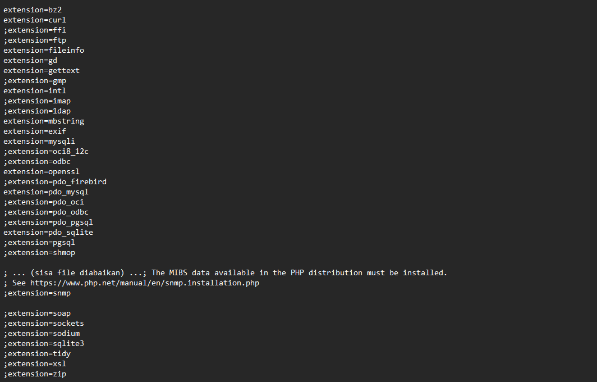


### Instalasi Codeigniter 4
Untuk melakukan instalasi Codeigniter 4 dapat dilakukan dengan dua cara, yaitu cara manual
dan menggunakan composer. Pada praktikum ini kita menggunakan cara manual.

• Unduh **Codeigniter** dari website https://codeigniter.com/download
• Extrak file zip Codeigniter ke direktori **htdocs/lab11_ci**.
• Ubah nama direktory **framework-4.x.xx** menjadi **ci4**.
• Buka browser dengan alamat http://localhost/lab11_ci/ci4/public/


### Menjalankan CLI (Command Line Interface)
Codeigniter 4 menyediakan CLI untuk mempermudah proses development. Untuk mengakses
CLI buka terminal pada VScode dengan menginpu "php spark serve" seperti pada hasil screenshot ini:
> 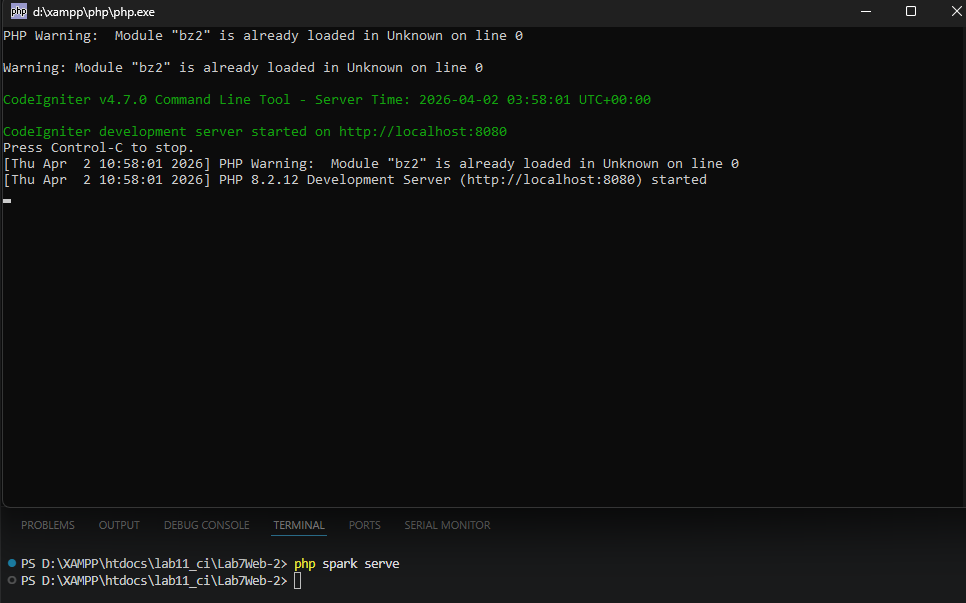


### Mengaktifkan Mode Debugging
Codeigniter 4 menyediakan fitur **debugging** untuk memudahkan developer untuk mengetahui
pesan error apabila terjadi kesalahan dalam membuat kode program.
Secara default fitur ini belum aktif.                       Semua jenis error akan ditampilkan sama. Untuk memudahkan mengetahui jenis errornya,
maka perlu diaktifkan mode debugging dengan mengubah nilai konfigurasi pada environment
variable **CI_ENVIRINMENT** menjadi **development**.
Ubah nama file **env** menjadi **.env** kemudian buka file tersebut dan ubah nilai variable
**CI_ENVIRINMENT** menjadi **development**.
Contoh error yang terjadi. Untuk mencoba error tersebut, ubah kode pada file
**app/Controller/Home.php** hilangkan titik koma pada akhir kode.


### Membuat Route Baru.
Pada Codeigniter, request yang diterima oleh file index.php akan diarahkan ke Router untuk
meudian oleh router tesebut diarahkan ke Controller.
Router terletak pada file **app/config/Routes.php**
Pada file tersebut kita dapat mendefinisikan route untuk aplikasi yang kita buat.
Contoh:
```php
$routes->get('/', 'Home::index');
```
Kode tersebut akan mengarahkan rute untuk halaman home.
Tambahkan kode berikut di dalam Routes.php
```php
$routes->get('/about', 'Page::about');
$routes->get('/contact', 'Page::contact');
$routes->get('/faqs', 'Page::faqs');
```
Untuk mengetahui route yang ditambahkan sudah benar, buka CLI dan jalankan perintah
berikut.

`php spark routes`


Selanjutnya coba akses route yang telah dibuat dengan mengakses alamat url
http://localhost:8080/about


### Membuat Controller
Selanjutnya adalah membuat Controller Page. Buat file baru dengan nama page.php pada
direktori Controller kemudian isi kodenya seperti berikut.
```php
<?php

namespace App\Controllers;

class Page extends BaseController
{
    public function about()
    {
    echo "Ini halaman About";
    }
    public function contact()
    {
    echo "Ini halaman Contact";
    }
    public function faqs()
    {
    echo "Ini halaman FAQ";
    }
}
```


### Auto Routing
Secara default fitur autoroute pada Codeiginiter sudah aktif. Untuk mengubah status autoroute
dapat mengubah nilai variabelnya. Untuk menonaktifkan ubah nilai true menjadi false.
`$routes->setAutoRoute(true);`

Tambahkan method baru pada **Controller Page** seperti berikut.
```php
public function tos()
{
echo "ini halaman Term of Services";
}
```

Method ini belum ada pada **routing**, sehingga cara mengaksesnya dengan menggunakan
alamat: http://localhost:8080/page/tos


### Membuat View
Selanjutnya adalam membuat view untuk tampilan web agar lebih menarik. Buat file baru
dengan nama about.php pada direktori view **(app/view/about.php)** kemudian isi kodenya seperti berikut.

```html
<!DOCTYPE html>
<html lang="en">
<head>
    <meta charset="UTF-8">
    <title><?= $title; ?></title>
</head>
<body>
    <h1><?= $title; ?></h1>
    <hr>
    <p><?= $content; ?></p>
</body>
</html>
```

Ubah **method about** pada class **Controller Page** menjadi seperti berikut:

```php
public function about()
{
    return view('about', [
        'title' => 'Halaman Abot',
        'content' => 'Ini adalah halaman abaut yang menjelaskan tentang isi halaman ini.'
    ]);
}
```

Lakukan refresh pada halaman tersebut.

Kemudian buat folder **template** pada direktori **view** kemudian buat file **header.php** dan
**footer.php**
File **app/view/template/header.php**

```php
<!DOCTYPE html>
<html lang="en">
<head>
    <meta charset="UTF-8">
    <title><?= $title; ?></title>
    <link rel="stylesheet" href="<?= base_url('/style.css');?>">
</head>
<body>
    <div id="container">
    <header>
        <h1>Layout Sederhana</h1>
    </header>
    <nav>
        <a href="<?= base_url('/');?>" class="active">Home</a>
        <a href="<?= base_url('/artikel');?>">Artikel</a>
        <a href="<?= base_url('/about');?>">About</a>
        <a href="<?= base_url('/contact');?>">Kontak</a>
    </nav>
    <section id="wrapper">
        <section id="main">
```

File **app/view/template/footer.php**

```html
        </section>
        <aside id="sidebar">
            <div class="widget-box">
                <h3 class="title">Widget Header</h3>
                <ul>
                    <li><a href="#">Widget Link</a></li>
                    <li><a href="#">Widget Link</a></li>
                </ul>
            </div>
            <div class="widget-box">
                <h3 class="title">Widget Text</h3>
                <p>Vestibulum lorem elit, iaculis in nisl volutpat,
                malesuada tincidunt arcu. Proin in leo fringilla, vestibulum mi porta,
                faucibus felis. Integer pharetra est nunc, nec pretium nunc pretium ac.</p>
            </div>
        </aside>
    </section>
    <footer>
        <p>&copy; 2021 - Universitas Pelita Bangsa</p>
    </footer>
    </div>
</body>
</html>
```

Kemudian ubah file **app/view/about.php** seperti berikut.
```php
<?= $this->include('template/header'); ?>
<h1><?= $title; ?></h1>
<hr>
<p><?= $content; ?></p>
<?= $this->include('template/footer'); ?>
```

Selanjutnya refresh tampilan pada alamat http://localhost:8080/about


---

## Modul Praktikum 2: Framework Lanjutan (CRUD)

### 1. Persiapan Database
Membuat database `lab_ci4` dan tabel `artikel` di MySQL melalui phpMyAdmin. Tabel ini memiliki kolom seperti id, judul, isi, gambar, status, dan slug. Selanjutnya, melakukan konfigurasi koneksi database pada file `.env` di CodeIgniter agar aplikasi terhubung ke MySQL.
> 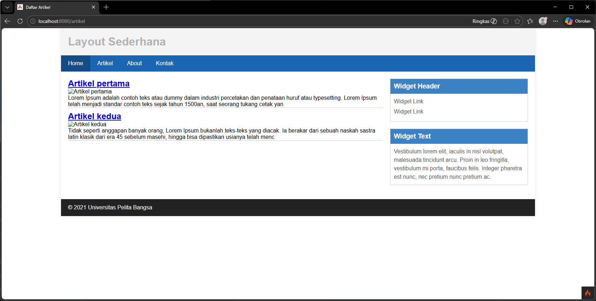

### 2. Membuat Model
Membuat file `ArtikelModel.php` di dalam folder `app/Models/`. Model ini bertugas untuk merepresentasikan tabel `artikel` dan mengatur kolom mana saja yang diizinkan untuk diisi data (`$allowedFields = ['judul', 'isi', 'status', 'slug', 'gambar']`).
> 

### 3. Membuat Controller dan View (Menampilkan Data)
Membuat file `Artikel.php` di folder `app/Controllers/` dengan fungsi `index()` untuk mengambil semua data dari model. Data tersebut kemudian dikirim ke file `app/Views/artikel/index.php` untuk ditampilkan ke pengguna menggunakan perulangan `foreach`. Dibuat juga fitur Detail Artikel yang akan menampilkan isi penuh artikel berdasarkan parameter slug.
> 
> 

### 4. Membuat Menu Admin (Sistem CRUD)
Membuat rute khusus admin (`/admin/artikel`) untuk mengelola data secara dinamis.
- **Read:** Menampilkan data dari database dalam bentuk tabel rapi lengkap dengan tombol aksi.
- **Create:** Membuat fungsi `add()` di Controller dan file view `form_add.php` untuk menginput artikel baru.
- **Update:** Membuat fungsi `edit()` di Controller dan file view `form_edit.php` yang menampilkan data lama di dalam kotak isian untuk kemudian diperbarui.
- **Delete:** Membuat fungsi `delete()` di Controller untuk menghapus baris data dari database berdasarkan ID artikel tanpa memerlukan view tambahan.
> 
> 


## Praktikum 3: View Layout dan View Cell

### Tujuan
Pada praktikum ini saya mempelajari penggunaan **View Layout** dan **View Cell** pada CodeIgniter 4.  
View Layout digunakan untuk membuat template tampilan yang konsisten, sedangkan View Cell digunakan untuk menampilkan komponen yang dapat dipakai ulang, seperti sidebar artikel terbaru.

---

### 1. Membuat Layout Utama
Pada tahap ini dibuat file `app/Views/layout/main.php` sebagai layout utama aplikasi.  
Layout ini berisi struktur halaman, menu navigasi, area konten utama dengan `renderSection('content')`, dan sidebar yang memanggil View Cell `ArtikelTerkini`.

> 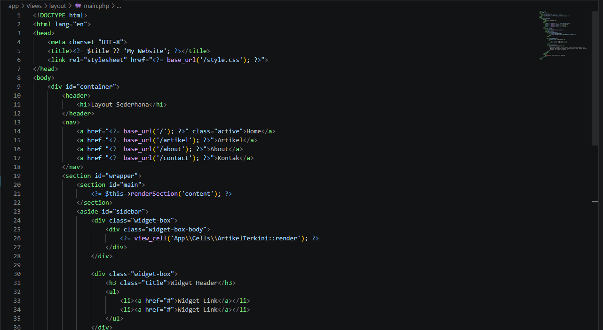

---

### 2. Modifikasi File View
File view seperti `home.php`, `about.php`, dan `contact.php` diubah agar menggunakan layout baru dengan sintaks `extend('layout/main')` dan `section('content')`.

#### a. home.php
> 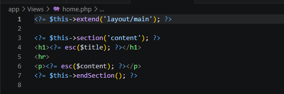

#### b. about.php
> 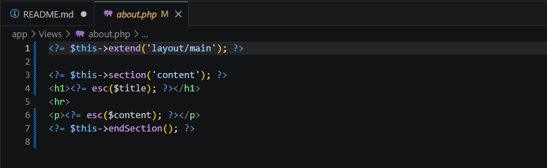

#### c. contact.php
> 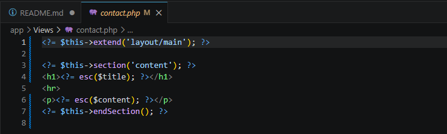

---

### 3. Membuat Class View Cell
Selanjutnya dibuat file `app/Cells/ArtikelTerkini.php`.  
Class ini bertugas mengambil 5 artikel terbaru dari database berdasarkan field `created_at`, lalu mengirimkannya ke view komponen.

> 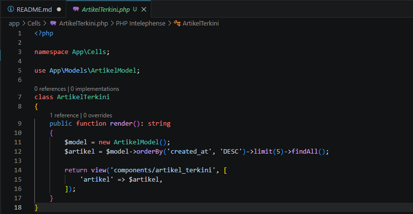

---

### 4. Membuat View untuk View Cell
Setelah class View Cell dibuat, dibuat juga file `app/Views/components/artikel_terkini.php` untuk menampilkan daftar artikel terbaru pada sidebar.

> 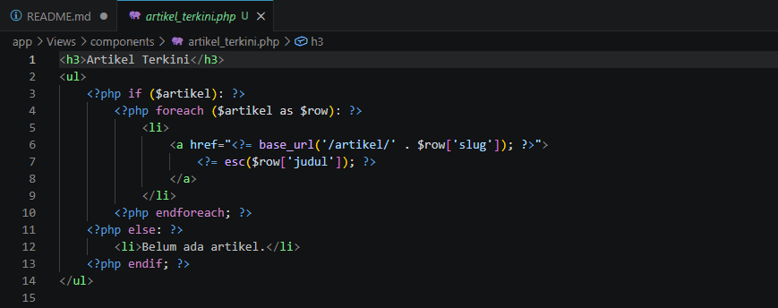

---

### 5. Menyesuaikan Struktur Database
Agar artikel terbaru dapat diambil berdasarkan waktu pembuatan, tabel `artikel` pada database ditambahkan field:
- `created_at`
- `updated_at`

> 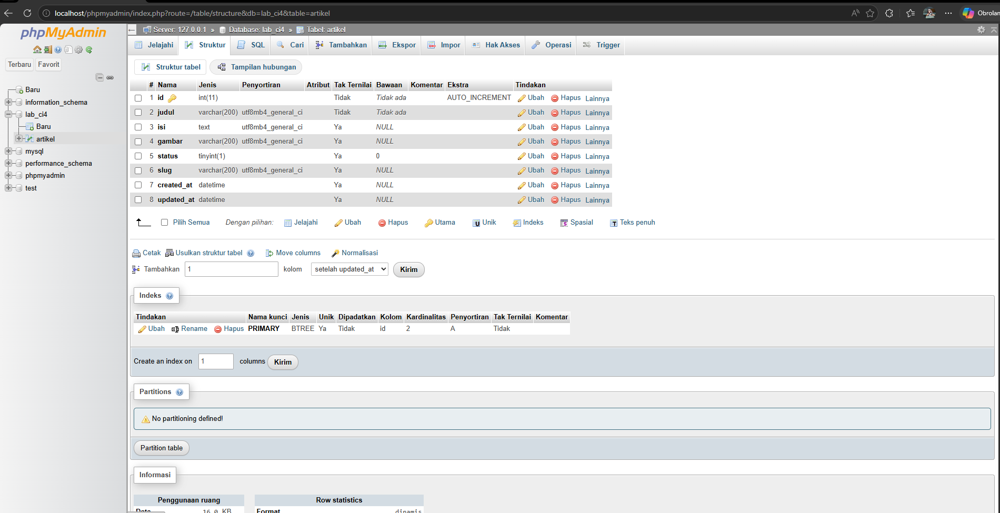

---

### 6. Hasil Pengujian Tampilan

#### a. Halaman Home
Hasil pengujian menunjukkan bahwa halaman home berhasil menggunakan layout utama dan sidebar artikel terkini tampil dengan benar.

> 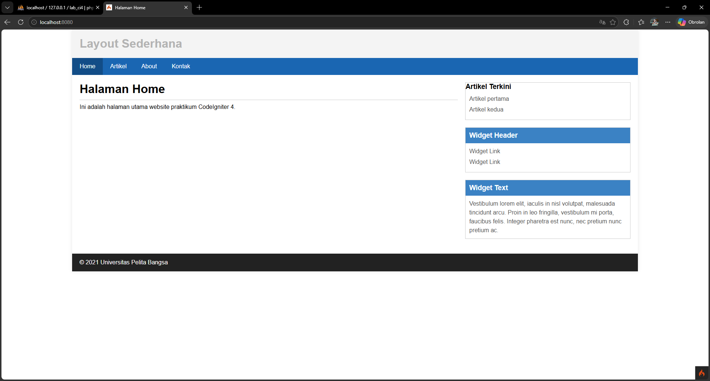

#### b. Halaman About
Halaman about juga berhasil menggunakan layout yang sama sehingga tampilan antar halaman menjadi konsisten.

> 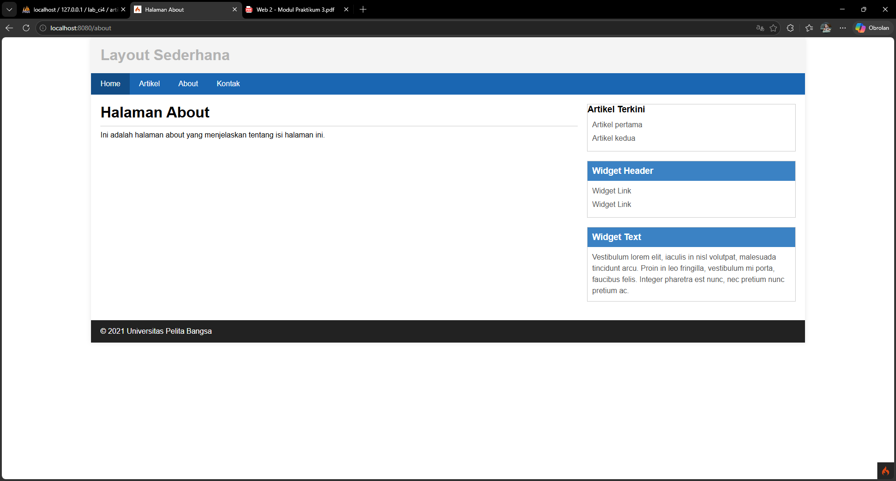

#### c. Halaman Contact
Halaman contact berhasil menampilkan isi halaman dengan layout utama dan sidebar yang sama.

> 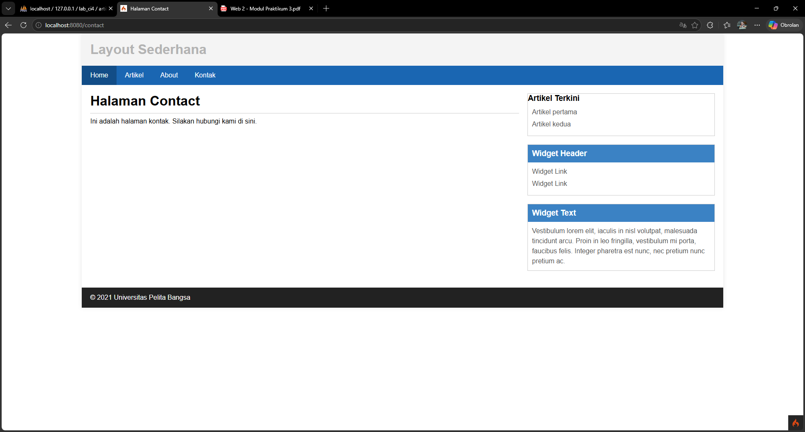

#### d. Halaman Artikel
Halaman artikel berhasil menampilkan daftar artikel dan tetap menggunakan layout utama beserta sidebar.

> 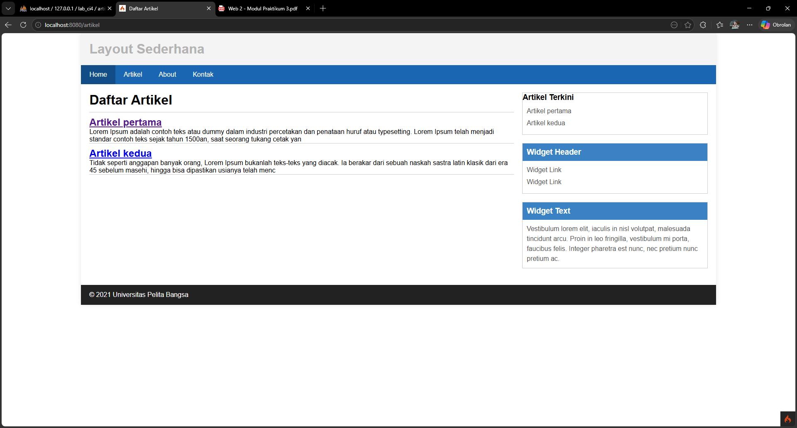

---

### 7. Pembahasan

#### Apa manfaat utama dari penggunaan View Layout dalam pengembangan aplikasi?
View Layout memudahkan pengembang dalam membuat tampilan yang konsisten pada banyak halaman.  
Dengan View Layout, bagian umum seperti header, navigasi, sidebar, dan footer tidak perlu ditulis berulang pada setiap file view, sehingga kode menjadi lebih rapi, mudah dirawat, dan efisien.

#### Jelaskan perbedaan antara View Cell dan View biasa.
View biasa digunakan untuk menampilkan isi halaman utama yang dipanggil langsung dari controller.  
Sedangkan View Cell digunakan untuk menampilkan komponen kecil yang dapat digunakan ulang di berbagai halaman, misalnya sidebar, widget, menu, atau daftar artikel terbaru.

#### Ubah View Cell agar hanya menampilkan post dengan kategori tertentu.
View Cell dapat dimodifikasi dengan menambahkan filter kategori pada query model.  
Contohnya, jika tabel artikel memiliki field `kategori`, maka query dapat diubah menjadi:

```php
$artikel = $model->where('kategori', 'Teknologi')
                 ->orderBy('created_at', 'DESC')
                 ->limit(5)
                 ->findAll();
```

---

## Praktikum 4: Framework Lanjutan (Modul Login)

### Tujuan
Pada praktikum ini saya mempelajari pembuatan **modul login** menggunakan CodeIgniter 4.  
Selain itu, saya juga mempelajari konsep **Auth Filter**, **session**, dan **database seeder** untuk membatasi akses ke halaman admin dan mengelola proses autentikasi user.

---

### 1. Membuat Tabel User
Langkah pertama adalah membuat tabel `user` pada database.  
Tabel ini digunakan untuk menyimpan data akun yang akan dipakai dalam proses login.

Struktur tabel yang digunakan terdiri dari:
- `id`
- `username`
- `useremail`
- `userpassword`

> 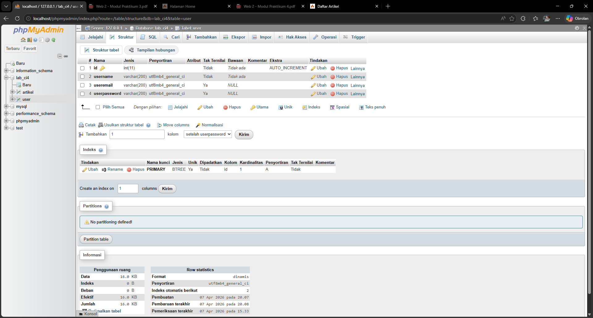

---

### 2. Menambahkan Data User
Setelah tabel dibuat, langkah berikutnya adalah menambahkan data user ke database.  
Data user ini akan digunakan sebagai akun login saat pengujian modul.

> 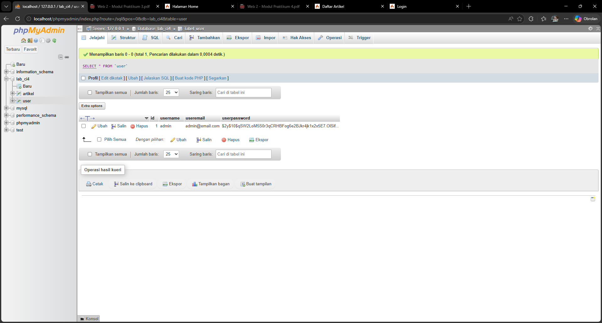

---

### 3. Membuat Model User
Kemudian dibuat file `app/Models/UserModel.php`.  
Model ini digunakan untuk memproses data user dari tabel `user`, khususnya saat proses autentikasi login.

> 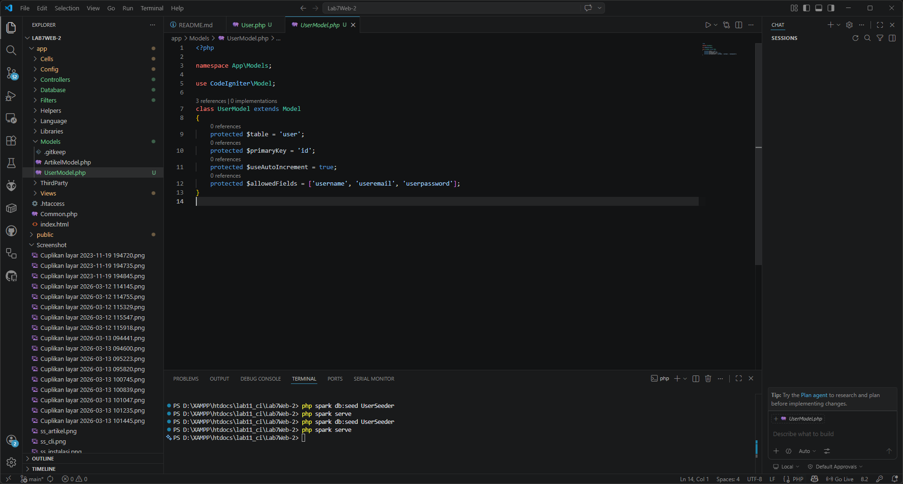

---

### 4. Membuat Controller User
Selanjutnya dibuat file `app/Controllers/User.php`.  
Controller ini berfungsi untuk:
- menampilkan data user,
- memproses login,
- menyimpan session login,
- dan menangani proses logout.

Pada method `login()`, sistem akan:
1. mengambil input email dan password,
2. mencari user berdasarkan email,
3. mencocokkan password menggunakan `password_verify()`,
4. menyimpan data login ke session,
5. dan mengarahkan user ke halaman admin artikel.

> 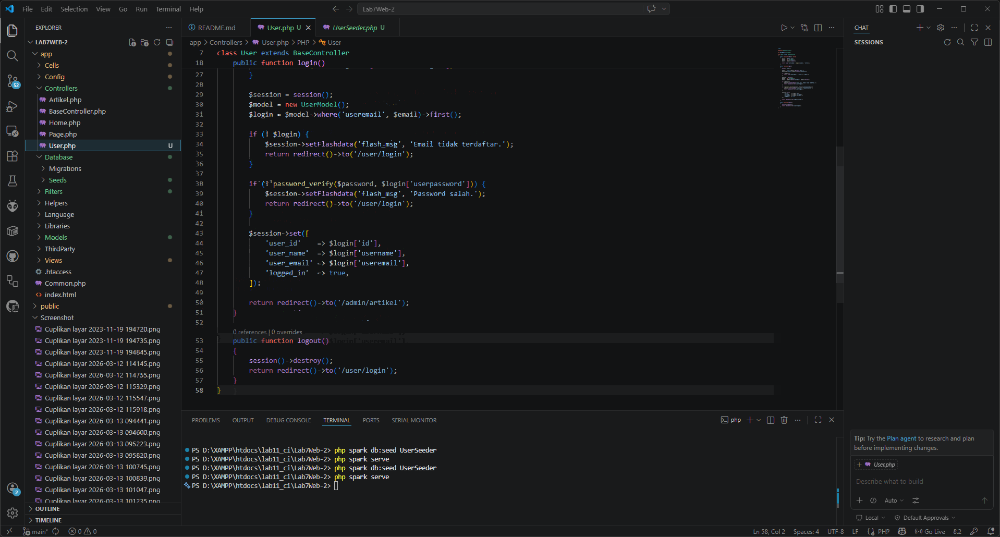

---

### 5. Membuat View Login
File `app/Views/user/login.php` dibuat untuk menampilkan form login.  
Form ini berisi input email dan password yang akan diproses oleh controller `User`.

> 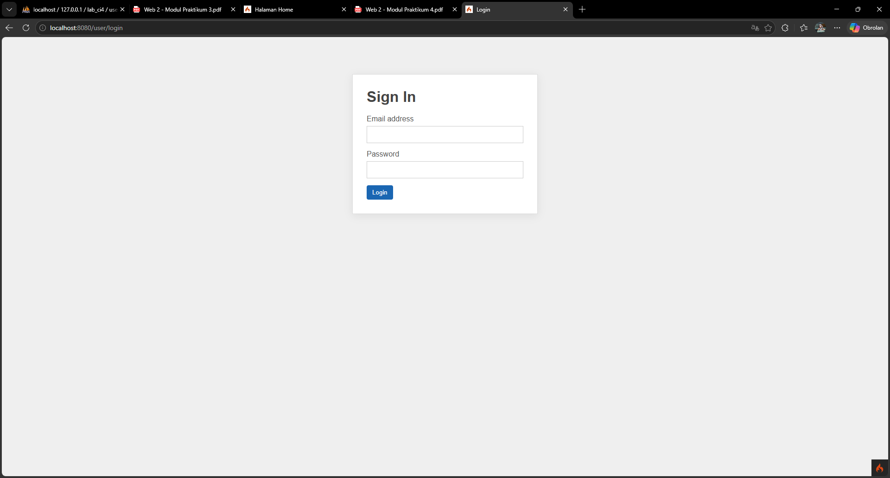

---

### 6. Membuat Seeder User
Agar proses pengujian lebih mudah, dibuat file `app/Database/Seeds/UserSeeder.php`.  
Seeder ini digunakan untuk menambahkan akun admin secara otomatis ke database.

Akun yang digunakan:
- Email: `admin@email.com`
- Password: `admin123`

Password disimpan dalam bentuk hash menggunakan `password_hash()`.

> 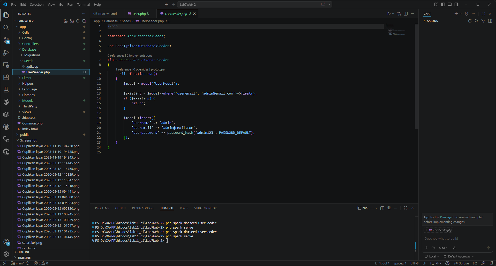

---

### 7. Membuat Auth Filter
Agar halaman admin tidak bisa diakses oleh user yang belum login, dibuat file `app/Filters/Auth.php`.  
Filter ini akan memeriksa apakah session `logged_in` tersedia atau tidak.  
Jika user belum login, maka sistem akan mengarahkan user ke halaman `/user/login`.

> 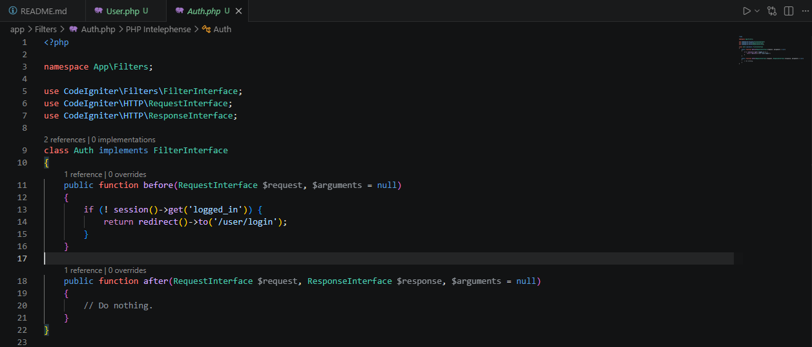

---

### 8. Menambahkan Alias Filter pada Filters.php
Setelah Auth Filter dibuat, file `app/Config/Filters.php` diperbarui dengan menambahkan alias filter.

Alias adalah nama singkat dari class filter.  
Pada modul ini digunakan alias `'auth' => Auth::class`.

Dengan alias tersebut, filter dapat dipanggil secara singkat pada route tanpa perlu menuliskan nama class lengkap.

> 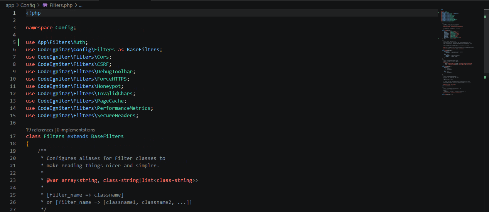

---

### 9. Mengatur Route Login dan Route Admin
File `app/Config/Routes.php` kemudian diperbarui untuk:
- menambahkan route `/user/login`,
- menambahkan route `/user/logout`,
- membuat route group `admin`,
- dan menerapkan filter `auth` pada route admin.

Dengan demikian, halaman admin hanya dapat diakses setelah user berhasil login.

> 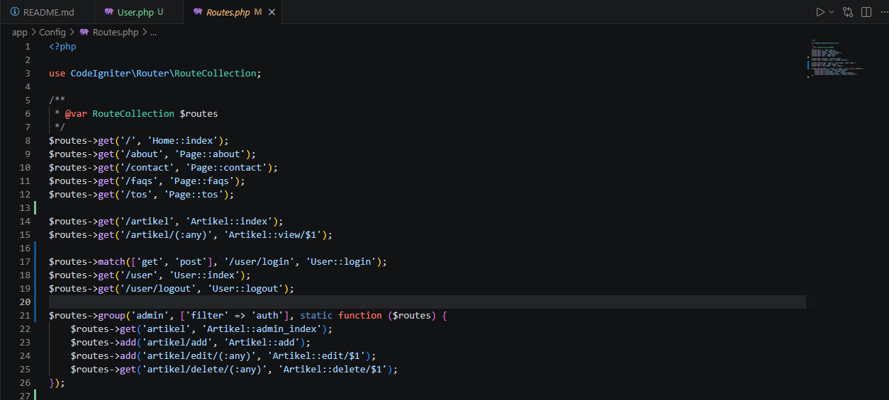

---

### 10. Hasil Pengujian

#### a. Halaman Login
Setelah semua konfigurasi selesai, halaman login berhasil ditampilkan melalui route `/user/login`.

> 

#### b. Login Berhasil Masuk ke Halaman Admin
Setelah login menggunakan akun admin, sistem berhasil mengarahkan user ke halaman admin artikel.

> 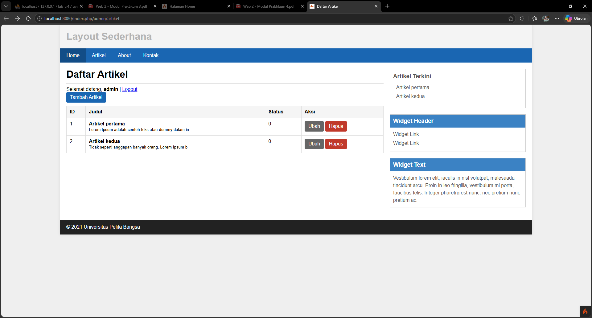

#### c. Redirect ke Login
Saat user belum login atau setelah session dihapus, sistem akan mengarahkan kembali ke halaman login. Karena tampilan akhirnya sama dengan halaman login biasa, dokumentasi ini menggunakan screenshot form login yang sama.

> 

---

### 11. Pembahasan

#### Apa fungsi Auth Filter?
Auth Filter digunakan untuk membatasi akses ke halaman tertentu.  
Pada modul ini, Auth Filter dipakai untuk melindungi halaman admin agar hanya dapat diakses oleh user yang sudah login.

#### Apa fungsi alias pada Filters.php?
Alias adalah nama singkat untuk filter.  
Dengan alias, filter dapat dipanggil dengan lebih sederhana pada route, misalnya cukup menggunakan `auth`.

#### Mengapa password disimpan dalam bentuk hash?
Password disimpan dalam bentuk hash untuk meningkatkan keamanan data user.  
Saat login, password diverifikasi dengan `password_verify()`.

#### Apa fungsi session dalam login?
Session digunakan untuk menyimpan status autentikasi user.  
Dengan session, sistem dapat mengetahui apakah user sedang login atau belum.

---

### 12. Kesimpulan
Pada praktikum ini saya berhasil membuat modul login pada CodeIgniter 4 dengan fitur:
- form login,
- validasi email dan password,
- session login,
- Auth Filter untuk proteksi halaman admin,
- database seeder untuk akun dummy,
- dan logout untuk menghapus session.

Dengan adanya modul login ini, akses ke halaman admin menjadi lebih aman dan terkontrol.

