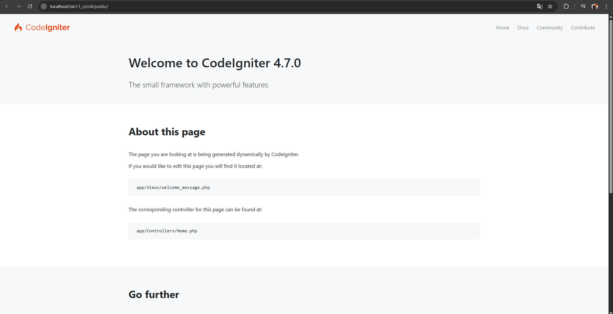
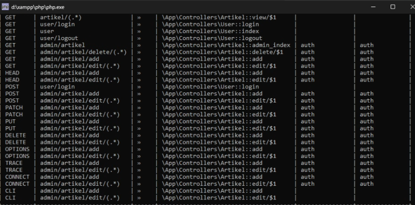
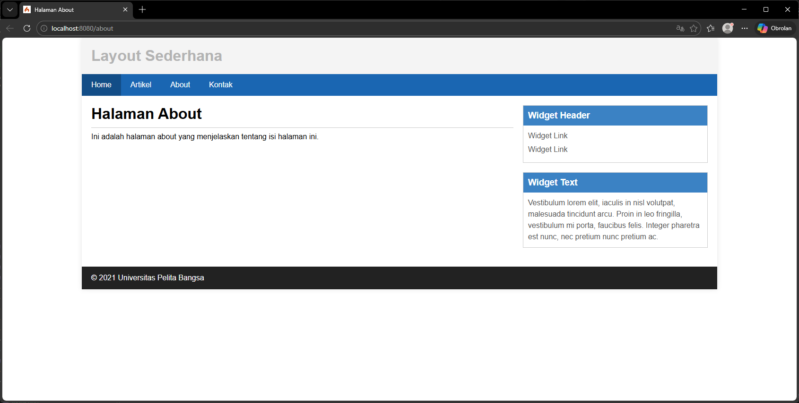
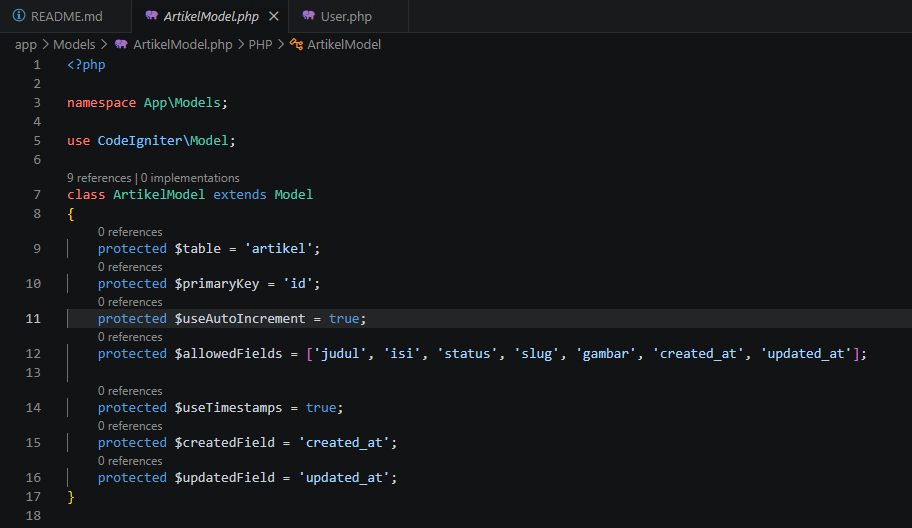
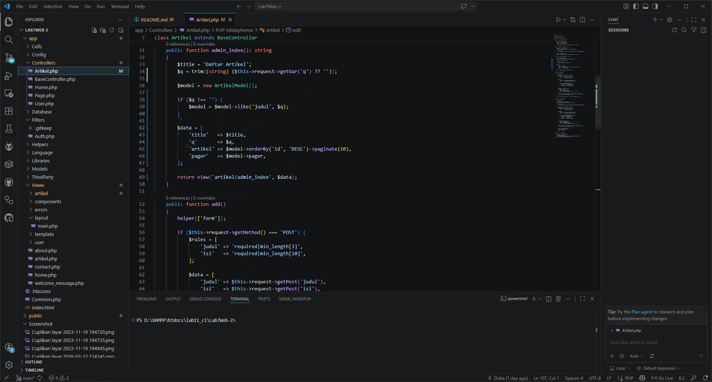
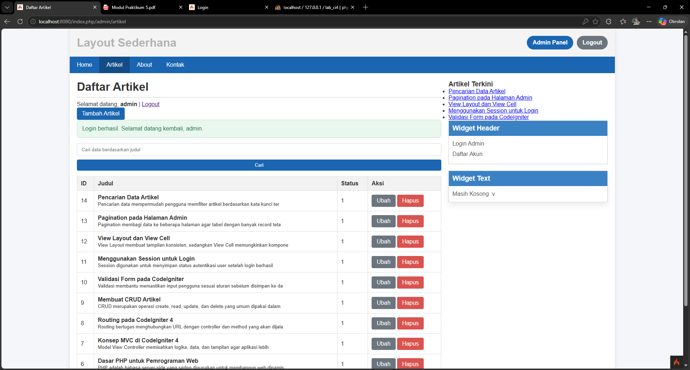
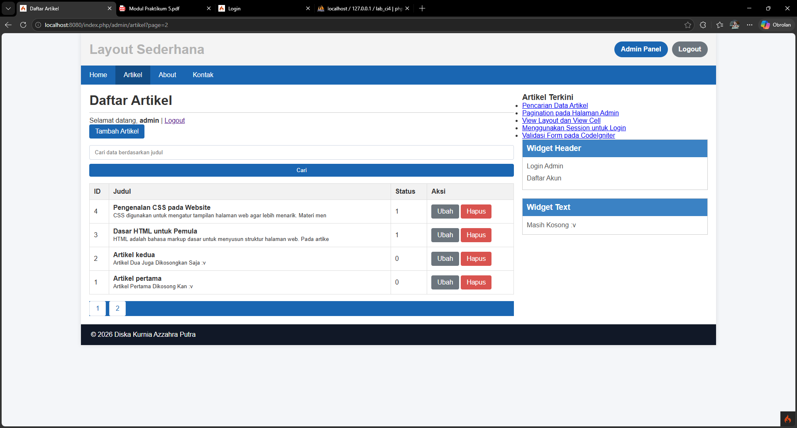
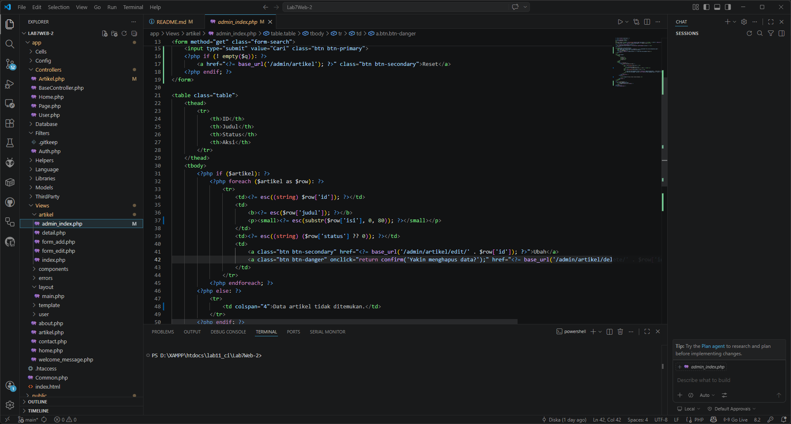
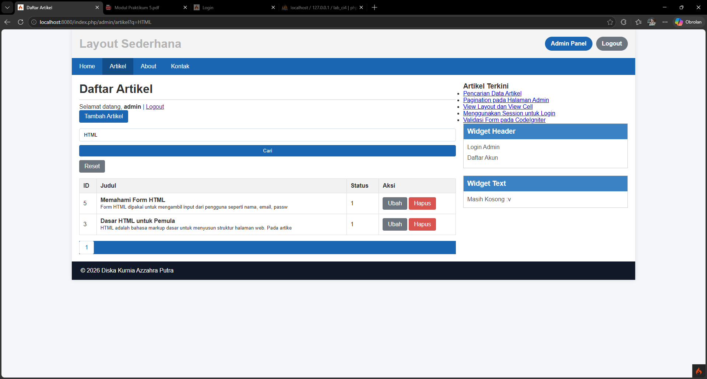

# Lab7Web

Repository ini untuk mencatat progress dari praktikum **Pemrograman Web 2** menggunakan **CodeIgniter 4**.  
Proses ini dilakukan secara bertahap dari **Praktikum 1** hingga **Praktikum 8**, dimulai dari instalasi framework, pembuatan routing dan tampilan dasar, pengembangan fitur **CRUD artikel**, penerapan **View Layout** dan **View Cell**, hingga pembuatan **modul login** untuk membatasi akses halaman admin, serta penerapan **pagination** dan **pencarian** pada halaman admin artikel.

## Teknologi yang Digunakan
- PHP 8
- CodeIgniter 4
- MySQL / MariaDB
- XAMPP
- Visual Studio Code
- phpMyAdmin

## Struktur Pembahasan
1. Praktikum 1: PHP Framework (CodeIgniter)
2. Praktikum 2: Framework Lanjutan (CRUD)
3. Praktikum 3: View Layout dan View Cell
4. Praktikum 4: Framework Lanjutan (Modul Login)
5. Praktikum 5: Pagination dan Pencarian
6. Praktikum 6: Relasi Tabel dan Query Builder
7. Praktikum 7: Upload File Gambar
8. Praktikum 8: AJAX

---

# Praktikum 1: PHP Framework (CodeIgniter)

## Tujuan
Pada modul pertama ini menggunakan **Framework CodeIgniter 4**,di mulai dari proses persiapan instalasi framework, penggunaan CLI, aktivasi mode debugging, pembuatan routing, controller, view, hingga penerapan layout sederhana untuk beberapa halaman.

## 1. Persiapan Lingkungan
Sebelum menggunakan CodeIgniter, ada beberapa extension PHP yang perlu diubah di XAMPP agar framework dapat berjalan. Ekstensi yang digunakan antara lain:
- `php-json`
- `php-mysqlnd`
- `php-xml`
- `php-intl`
- `libcurl`

Ekstensi tersebut diubah melalui **XAMPP Control Panel** pada menu **Apache > Config > PHP.ini**, lalu menghapus tanda titik koma (`;`) pada ekstensi yang dibutuhkan.

> 

## 2. Instalasi CodeIgniter 4
Instalasi CodeIgniter dilakukan secara manual dengan langkah berikut:
- mengunduh CodeIgniter dari situs resminya,
- mengekstrak file ke direktori `htdocs`,
- menyesuaikan nama folder project,
- lalu menjalankan aplikasi melalui browser.

Setelah instalasi berhasil, halaman default CodeIgniter dapat ditampilkan dengan baik.

> 

## 3. Menjalankan CLI CodeIgniter
CodeIgniter menyediakan **Command Line Interface (CLI)** yang mempermudah proses pengembangan.  
CLI dijalankan melalui terminal VS Code dengan perintah:

```bash
php spark serve
```

Perintah ini digunakan untuk menjalankan web server lokal bawaan CodeIgniter sehingga aplikasi dapat diakses melalui `http://localhost:8080`.

> 

## 4. Mengaktifkan Mode Debugging
Agar proses lebih mudah, mode debugging diaktifkan dengan mengubah file `env` menjadi `.env`, lalu mengatur nilai:

```env
CI_ENVIRONMENT = development
```

Dengan mode ini, pesan error akan tampil lebih jelas sehingga memudahkan proses analisis ketika terjadi kesalahan pada kode.

## 5. Membuat Route Baru
Setelah project berhasil dijalankan, langkah selanjutnya adalah menambahkan route baru pada file `app/Config/Routes.php`.  
Route digunakan untuk menghubungkan URL tertentu dengan controller yang akan memprosesnya.

Route yang ditambahkan antara lain:
- `/about`
- `/contact`
- `/faqs`

Untuk mengecek daftar route yang aktif, digunakan perintah:

```bash
php spark routes
```

> 

## 6. Membuat Controller Page
Setelah route dibuat, kemudian dilanjutkan dengan membuat controller `Page.php` pada folder `app/Controllers`.  
Controller ini berisi method:
- `about()`
- `contact()`
- `faqs()`
- `tos()`

Controller ini berfungsi untuk menangani request dari route yang telah dibuat sebelumnya.

## 7. Menggunakan Auto Routing
CodeIgniter juga menyediakan fitur **auto routing**, sehingga method controller yang belum didaftarkan secara manual di file route tetap dapat diakses melalui URL tertentu.  
Pada tahap ini ditambahkan method `tos()` pada controller `Page` untuk menguji fitur tersebut.

## 8. Membuat View dan Layout Dasar
Agar tampilan aplikasi menjadi lebih baik, dibuat file view seperti `about.php`, dilanjutkan dengan pembuatan layout sederhana menggunakan:
- `template/header.php`
- `template/footer.php`
- `public/style.css`

Dengan struktur ini, halaman-halaman seperti Home, About, Artikel, dan Kontak memiliki tampilan yang konsisten.

> 

## Kesimpulan Praktikum 1
Progres yang sudah selesai dari Praktikum/Modul pertama adalah:
- membuat lingkungan pengembangan CodeIgniter 4,
- instalasi framework,
- menjalankan CLI,
- mengaktifkan debugging,
- membuat route dan controller,
- serta membangun tampilan awal aplikasi dengan layout sederhana.

---

# Praktikum 2: Framework Lanjutan (CRUD)

## Tujuan
Pada praktikum kedua ini terdapat konsep **Model** dan implementasi **CRUD** (Create, Read, Update, Delete) menggunakan CodeIgniter 4 dengan studi kasus data artikel.

## 1. Persiapan Database
Tahap pertama adalah membuat database `lab_ci4` dan tabel `artikel` di MySQL.  
Tabel `artikel` digunakan untuk menyimpan data konten dengan field:
- `id`
- `judul`
- `isi`
- `gambar`
- `status`
- `slug`

Setelah itu, koneksi database dikonfigurasi melalui file `.env` agar aplikasi dapat terhubung ke MySQL.

## 2. Membuat Model Artikel
Selanjutnya dibuat file `ArtikelModel.php` pada folder `app/Models`.  
Model ini digunakan untuk merepresentasikan tabel `artikel` dan mendefinisikan field yang dapat diisi, sehingga proses manipulasi data lebih terstruktur.

> 

## 3. Menampilkan Data Artikel
Setelah model selesai dibuat, dibuat controller `Artikel.php` dan view `app/Views/artikel/index.php` untuk menampilkan daftar artikel dari database.  
Data yang berhasil ditambahkan ke tabel kemudian ditampilkan pada halaman artikel menggunakan perulangan.

> 

## 4. Membuat Detail Artikel
Agar setiap artikel dapat dibuka secara terpisah, dibuat method `view($slug)` pada controller `Artikel`.  
Method ini mengambil artikel berdasarkan nilai `slug`, lalu menampilkan isi lengkap artikel pada halaman detail.

## 5. Membuat Menu Admin untuk CRUD
Setelah fitur baca data berhasil, pengembangan dilanjutkan ke halaman admin artikel melalui route `/admin/artikel`.  
Pada bagian ini diterapkan fitur:
- **Create** untuk menambahkan artikel baru,
- **Read** untuk menampilkan daftar artikel di panel admin,
- **Update** untuk mengubah artikel,
- **Delete** untuk menghapus artikel dari database.

Fitur CRUD ini membuat pengelolaan artikel menjadi lebih dinamis karena tidak lagi dilakukan langsung melalui PHPMyAdmin.

## Kesimpulan Praktikum 2
Progres yang berhasil dibuat pada Pratikum ini adalah:
- membuat database artikel,
- menghubungkan aplikasi dengan MySQL,
- membangun model dan controller artikel,
- menampilkan daftar artikel dan detail artikel,
- serta membuat fitur CRUD sederhana melalui halaman admin.

---

# Praktikum 3: View Layout dan View Cell

## Tujuan
Pada praktikum ini saya mempelajari penggunaan **View Layout** dan **View Cell** pada CodeIgniter 4.  
View Layout digunakan agar template tampilan tetap konsisten, sedangkan View Cell digunakan dalam menampilkan komponen yang dapat dipakai ulang, seperti daftar artikel terbaru di sidebar.

## 1. Membuat Layout Utama
Pada tahap ini dibuat file `app/Views/layout/main.php` sebagai layout utama aplikasi.  
Layout ini berisi:
- header,
- menu navigasi,
- area konten utama dengan `renderSection('content')`,
- sidebar,
- dan footer.

Layout utama ini menjadi fondasi tampilan yang dipakai ulang pada beberapa halaman.

> 

## 2. Memodifikasi File View
File view seperti `home.php`, `about.php`, dan `contact.php` disesuaikan agar menggunakan layout utama dengan sintaks:
- `extend('layout/main')`
- `section('content')`

### a. File Home
> 

### b. File About
> 

### c. File Contact
> 

## 3. Membuat Class View Cell
Selanjutnya membuat file `app/Cells/ArtikelTerkini.php`.  
Class ini bertugas mengambil lima artikel terbaru dari database berdasarkan field `created_at`, lalu mengirimkannya ke komponen view sidebar.

> 

## 4. Membuat View Komponen untuk Sidebar
Setelah class View Cell selesai dibuat, langkah berikutnya adalah membuat file `app/Views/components/artikel_terkini.php` untuk menampilkan daftar artikel terbaru pada sidebar.

> 

## 5. Menyesuaikan Struktur Database
Agar data artikel terbaru dapat diurutkan berdasarkan waktu pembuatan, tabel `artikel` diperbarui dengan menambahkan field:
- `created_at`
- `updated_at`

> 

## 6. Hasil Pengujian Tampilan
Setelah layout dan View Cell diterapkan, seluruh halaman memiliki tampilan yang lebih konsisten.

### a. Halaman Home
> 

### b. Halaman About
> 

### c. Halaman Contact
> 

### d. Halaman Artikel
> 

## 7. Pembahasan
### Apa manfaat utama penggunaan View Layout?
View Layout dapat memudahkan pengembang dalam membuat tampilan yang konsisten di banyak halaman.  
Biasanya seperti header, navigasi, sidebar, dan footer tidak perlu ditulis berulang kali, sehingga kode menjadi lebih rapi dan mudah dirawat.

### Apa perbedaan View Cell dan View biasa?
View digunakan untuk menampilkan isi halaman utama yang dipanggil langsung dari controller.  
Sedangkan View Cell digunakan untuk menampilkan komponen kecil yang dapat digunakan ulang pada banyak halaman, seperti sidebar, widget, atau daftar artikel terbaru.

### Bagaimana jika View Cell hanya ingin menampilkan kategori tertentu?
View Cell dapat dimodifikasi dengan penambahan filter kategori pada query model.  
Contohnya, jika tabel artikel memiliki field `kategori`, maka query bisa disesuaikan untuk hanya menampilkan artikel dari kategori tertentu.

## Kesimpulan Praktikum 3
Progress dari praktikum ini adalah:
- pembuatan layout utama berbasis View Layout,
- memisahkan tampilan halaman ke dalam section,
- membuat View Cell untuk artikel terbaru,
- serta menampilkan data dinamis pada sidebar secara modular.

---

# Praktikum 4: Framework Lanjutan (Modul Login)

## Tujuan
Pada praktikum 4 ini terdapat pembuatan **modul login** menggunakan CodeIgniter 4.  
Selain itu, terdapat juga konsep **session**, **Auth Filter**, dan **database seeder** untuk membatasi akses ke halaman admin.

## 1. Membuat Tabel User
Langkah pertama adalah membuat tabel `user` pada database.  
Tabel ini digunakan untuk menyimpan akun yang akan dipakai pada proses login.

Field yang digunakan terdiri dari:
- `id`
- `username`
- `useremail`
- `userpassword`

> 

## 2. Menambahkan Data User
Setelah tabel dibuat, data user ditambahkan ke database untuk keperluan pengujian login.

> 

## 3. Membuat Model User
Kemudian dibuat file `app/Models/UserModel.php` untuk memproses data login dari tabel `user`.

> 

## 4. Membuat Controller User
Selanjutnya dibuat file `app/Controllers/User.php`.  
Controller ini digunakan untuk:
- menampilkan data user,
- memproses login,
- menyimpan session,
- dan menangani logout.

Pada proses login, sistem:
1. mengambil input email dan password,
2. mencari user berdasarkan email,
3. memverifikasi password dengan `password_verify()`,
4. menyimpan session login,
5. dan mengarahkan user ke halaman admin artikel.

> 

## 5. Membuat View Login
File `app/Views/user/login.php` dibuat untuk menampilkan form login yang digunakan dalam proses autentikasi.

> 

## 6. Membuat Seeder User
Untuk mempermudah pengujian, dibuat file `app/Database/Seeds/UserSeeder.php`.  
Seeder ini digunakan untuk menambahkan akun admin secara otomatis ke database.

Akun default yang digunakan:
- Email: `admin@email.com`
- Password: `admin123`

Password disimpan dalam bentuk hash menggunakan `password_hash()`.

> 

## 7. Membuat Auth Filter
Agar halaman admin tidak dapat diakses oleh user yang belum login, dibuat file `app/Filters/Auth.php`.  
Filter ini memeriksa session `logged_in`. Jika session tidak tersedia, maka user akan diarahkan ke halaman login.

> 

## 8. Menambahkan Alias Filter pada Filters.php
Setelah Auth Filter dibuat, file `app/Config/Filters.php` diperbarui dengan menambahkan alias filter, yaitu `auth`, agar filter dapat dipanggil lebih mudah pada routing.

> 

## 9. Mengatur Route Login dan Route Admin
File `app/Config/Routes.php` kemudian diperbarui untuk:
- menambahkan route login,
- menambahkan route logout,
- membuat group route `admin`,
- dan menerapkan filter `auth` pada route admin.

> 

## 10. Hasil Pengujian
### a. Halaman Login
Setelah konfigurasi selesai, halaman login berhasil ditampilkan melalui route `/user/login`.

> 

### b. Login Berhasil Masuk ke Halaman Admin
Setelah login menggunakan akun admin, sistem berhasil mengarahkan user ke halaman admin artikel.

> 

### c. Redirect ke Login
Saat user belum login atau setelah session dihapus, sistem akan diarahkan kembali ke halaman login. Karena tampilan akhirnya sama dengan form login biasa, dokumentasi menggunakan screenshot login yang sama.

> 

## 11. Pembahasan
### Apa fungsi Auth Filter?
Auth Filter digunakan untuk membatasi akses ke halaman tertentu.  
Pada modul ini, Auth Filter melindungi halaman admin agar hanya dapat diakses oleh user yang sudah login.

### Apa fungsi alias pada Filters.php?
Alias adalah nama singkat dari class filter.  
Dengan alias, filter dapat dipanggil lebih sederhana pada route, misalnya cukup menggunakan `auth`.

### Mengapa password disimpan dalam bentuk hash?
Password disimpan dalam bentuk hash untuk meningkatkan keamanan data user.  
Saat login, password diverifikasi menggunakan `password_verify()` sehingga password asli tidak disimpan dalam bentuk teks biasa.

### Apa fungsi session dalam login?
Session digunakan untuk menyimpan status autentikasi user.  
Dengan session, sistem dapat mengetahui apakah user sedang login atau belum.

## Kesimpulan Praktikum 4
Progres dari Praktiku ini adalah:
- membuat tabel user,
- membuat sistem login sederhana,
- menambahkan akun dummy dengan seeder,
- menerapkan Auth Filter untuk proteksi halaman admin,
- dan mengimplementasikan logout berbasis session.

---

---


# Praktikum 5: Pagination dan Pencarian

## Tujuan
Pada praktikum ini terdapat penambahan fitur **pagination** dan **pencarian data** pada halaman admin artikel.  
Pagination digunakan untuk membagi daftar artikel menjadi beberapa halaman, sedangkan pencarian digunakan untuk memfilter data berdasarkan judul artikel.

## 1. Menambahkan Pagination pada Halaman Admin
Perubahan pertama dilakukan pada method `admin_index()` di file `app/Controllers/Artikel.php`.  
Data artikel sebelumnya ditampilkan seluruhnya, kemudian diubah menggunakan method `paginate(10)` agar data dibatasi menjadi **10 artikel per halaman**.  
Selain itu ditambahkan juga object `pager` untuk menampilkan navigasi halaman.

> 

## 2. Menampilkan Navigasi Halaman
Setelah controller diperbarui, file `app/Views/artikel/admin_index.php` disesuaikan agar menampilkan pagination pada bagian bawah tabel data artikel.  
Pada tahap ini, daftar artikel yang jumlahnya lebih dari 10 data akan otomatis terbagi menjadi beberapa halaman.

### a. Halaman Pagination Page 1
> 

### b. Halaman Pagination Page 2
> 

## 3. Menambahkan Form Pencarian
Langkah berikutnya adalah menambahkan fitur pencarian pada halaman admin artikel.  
Pada method `admin_index()`, query pencarian diambil dari parameter `q`, lalu digunakan dengan method `like('judul', $q)` untuk memfilter artikel berdasarkan judul.

Selanjutnya pada file `app/Views/artikel/admin_index.php` ditambahkan form pencarian menggunakan method `GET`, sehingga kata kunci bisa dikirim melalui URL.

> 

## 4. Menampilkan Hasil Pencarian
Setelah form pencarian ditambahkan, halaman admin artikel dapat menampilkan data berdasarkan kata kunci tertentu.  
Pada pengujian ini digunakan kata kunci **HTML**, dan hasil yang muncul hanya artikel yang judulnya sesuai dengan pencarian.

> 

## Kesimpulan Praktikum 5
Progress pada praktikum ini adalah:
- menambahkan pagination pada halaman admin artikel,
- membatasi tampilan data menjadi 10 record per halaman,
- menambahkan form pencarian artikel,
- memfilter artikel berdasarkan judul,
- serta menjaga query pencarian tetap aktif saat berpindah halaman pagination.

---


---

# Praktikum 6: Relasi Tabel dan Query Builder

## Tujuan
Praktikum ini menambahkan relasi **One-to-Many** antara tabel `kategori` dan tabel `artikel`. Satu kategori dapat memiliki banyak artikel, sedangkan setiap artikel menyimpan foreign key `id_kategori`.

## Perubahan yang Diterapkan
- Menambahkan `KategoriModel.php`.
- Menambahkan field `id_kategori` pada `ArtikelModel.php`.
- Menggunakan `join()` untuk menampilkan `nama_kategori` pada halaman artikel dan admin.
- Menambahkan filter kategori pada halaman admin dan halaman depan.
- Menampilkan kategori pada halaman detail artikel.
- Menambahkan migration `2026-05-15-000001_UpdateArtikelKategoriGambar.php`.

## Cara Menjalankan Update Database
Gunakan salah satu cara berikut:

```bash
php spark migrate
```

atau import file:

```text
database_update_praktikum_6_7_8.sql
```

---

# Praktikum 7: Upload File Gambar

## Tujuan
Praktikum ini menambahkan fitur upload gambar pada artikel.

## Perubahan yang Diterapkan
- Form tambah artikel memakai `enctype="multipart/form-data"`.
- Form edit artikel dapat mengganti gambar lama.
- Gambar disimpan di folder `public/gambar`.
- Controller melakukan validasi tipe file gambar dan ukuran maksimal 2 MB.
- Halaman admin, halaman daftar artikel, dan detail artikel menampilkan gambar jika tersedia.

---

# Praktikum 8: AJAX

## Tujuan
Praktikum ini menambahkan halaman pengelolaan artikel berbasis AJAX agar data dapat dimuat, ditambah, diubah, dan dihapus tanpa reload halaman penuh.

## Perubahan yang Diterapkan
- Menambahkan `AjaxController.php`.
- Menambahkan view `app/Views/ajax/index.php`.
- Menambahkan jQuery lokal di `public/assets/js/jquery-3.7.1.min.js`.
- Menambahkan route `/ajax`, `/ajax/getData`, `/ajax/create`, `/ajax/update/{id}`, dan `/ajax/delete/{id}`.
- Halaman AJAX dilindungi filter `auth`, sehingga harus login terlebih dahulu.

## Cara Membuka
Login sebagai admin, lalu buka:

```text
http://localhost:8080/ajax
```

atau klik tombol **Dashboard** pada header setelah login.

---

# Catatan Folder Materi PDF

Agar ukuran ZIP tetap kecil, folder `file` di root project dibuat dalam keadaan kosong. Pindahkan PDF materi ke:

```text
Lab7Web-2/file/
```

Nama file PDF harus sama dengan daftar yang ada pada method `getMateriList()` di `app/Controllers/Artikel.php`, misalnya:

```text
Modul Praktikum 7.pdf
Modul Praktikum 8.pdf
Mastering_CI4_AJAX.pdf
07 Blueprint_Relasi_CI4.pdf
```

Jika file belum dipindahkan, tombol download pada halaman materi akan menampilkan status **PDF belum dipindahkan**.

# END


## Update Tambahan: Dashboard dan Login Praktikum

Perubahan tambahan untuk memudahkan penggunaan aplikasi:

1. Menu **AJAX** pada navigasi diganti menjadi **Dashboard** agar tampil seperti halaman pengelolaan milik website, bukan sekadar halaman praktikum.
2. Judul halaman **Praktikum 8: AJAX Artikel** diganti menjadi **Dashboard Pengelolaan Artikel**.
3. Isi halaman dashboard dibuat lebih natural sebagai halaman admin untuk mengelola artikel.
4. Login admin sekarang bisa menggunakan salah satu dari:
   - ID user, contoh: `1`
   - username, contoh: `admin`
   - email, contoh: `admin@email.com`
5. Password untuk kebutuhan pembelajaran lokal boleh pendek, termasuk 1 karakter.
6. Akun bawaan:
   - ID: `1`
   - Username: `admin`
   - Email: `admin@email.com`
   - Password: `1`

Jika data lama masih digunakan, jalankan:

```bash
php spark migrate
```

atau jalankan `database_update_praktikum_6_7_8.sql` melalui phpMyAdmin.
